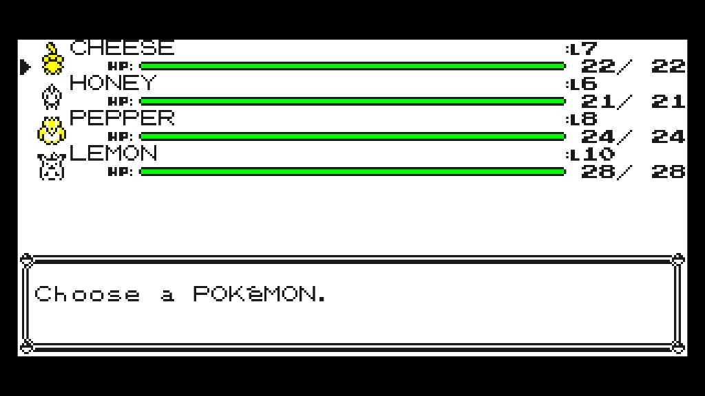
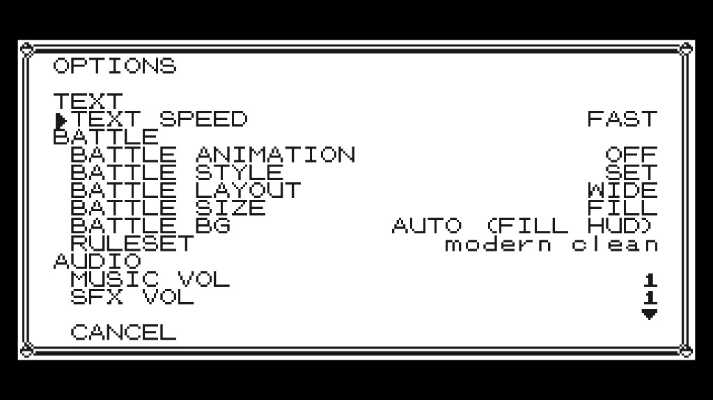
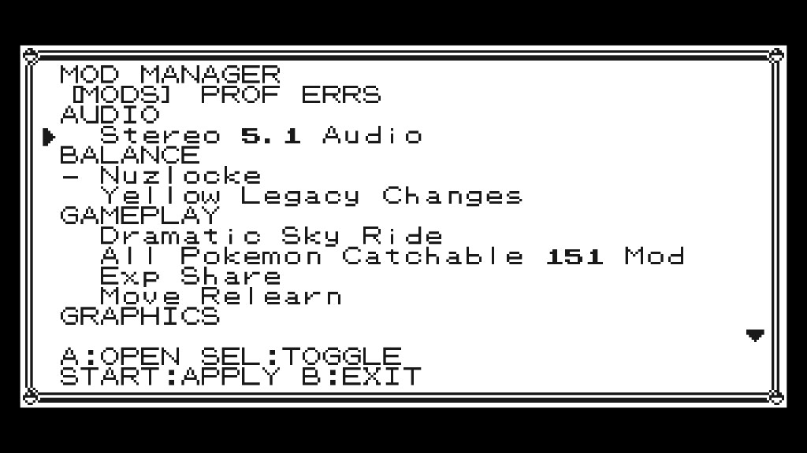

# Wide Menus

A UI mod for [gen1recomp](https://github.com/bryanthaboi/gen1recomp). It stretches text-heavy menus to the same **304×144** canvas as
**OPTIONS → BATTLE LAYOUT → WIDE**, so labels, values, and list rows have room to breathe. Red/Blue/Yellow and Gold.

Overworld dialogue, naming, the trainer card, Oak's intro, and the START menu stay Game Boy sized.
**Version 0.4.0** · id `wide-menus` · category UI · per-screen toggles

## What it changes

These screens fill the wide canvas (each one is a toggle in the mod's OPTIONS, all on by default):

- OPTIONS (Red/Blue/Yellow and Gold/Silver/Crystal; separate toggles)
- Mod Manager (F10)
- Bag, shop, Pokédex, and button bindings (Red/Blue/Yellow)
- Party list (Red/Blue/Yellow and Gold/Silver/Crystal; names on the left, HP/level on the right)
- Gold mart BUY (SELL stays classic-centered on the pack art)
- Full-screen menus registered by other mods (opaque screens)

On a wide OPTIONS screen the layout follows Gen1BetterMenus: one outer frame, 12 compact rows, the label on the left and the value on the right, with group headings (TEXT / BATTLE / AUDIO / …). The cursor stays in the gutter so it does not sit on the first letter. List menus spread the item name and the right-hand column (price, quantity, and so on) across the extra width. Money boxes and footers grow with the canvas.

YES / NO and quantity prompts stay classic unless they open on top of a wide list — then they pin to the wide parent so they do not snap the screen back to 160. The same applies to transparent overlays from other mods (Move Relearn, forget-move lists): the canvas stays 304 and their bottom message box grows with it.

## Screenshots







## What stays classic

These keep the original 160×144 layout:

- Overworld dialogue and choice boxes
- START menu
- Naming screen
- Trainer card
- Oak intro
- Pokémon summary
- Pokédex entries
- Town map, diploma, credits, Hall of Fame
- PC boxes, move tutor, Fly list, slot machine
- Gold pack, Pokédex, Pokégear, save, clock, and intro

## Install

1. Get a `wide-menus` zip or `.modpkg` from a [GitHub release](https://github.com/juancdominici/wide-menus/releases).
2. In the launcher, open **MODS** and choose **Import mod .zip** (or drop the file onto the window). On Switch, copy it into the save-dir `imports/mods/` folder, then **Scan again**.
3. Enable **Wide Menus**. The first time, grant **PATCHES ENGINE CODE** (`engine_internals`) — the mod has to wrap shared UI drawing to stretch those screens.
4. Apply / restart when the manager asks.

You can also toggle it in-game with **F10** (Mod Manager). Open **OPTIONS** on Wide Menus to turn individual screens back to 160×144. Everything starts **ON** (the previous always-wide behavior).

## Development

This repo _is_ the mod. The engine loads it from `gen1recomp/mods/wide-menus` (the folder name must match the manifest id). Junction or clone it there:

```bat
mklink /J C:\path\to\gen1recomp\mods\wide-menus C:\path\to\wide-menus
```

From the engine root:

```sh
python3 tools/modkit.py pack mods/wide-menus
luajit mods/wide-menus/tests/ui_mod_api_test.lua
```

## Requirements

- Engine **0.x** (manifest range `>=0.0.0 <2.0.0`)
- Mod API **2**
- Permission **engine_internals**

It does not depend on other mods. It does not need **BATTLE LAYOUT** set to WIDE; menus use the 304-wide surface on their own. If you are in a classic (OG) battle, overlays over that battle stay 160 so they match the fight.

## Other mods

`mod.ui.ListMenu` / OPTIONS-style screens widen on their own. Custom opaque screens default to wide; naming, summary, dex entry, town map, and diploma stay classic.

Authors of a native-looking custom menu should declare `"optional_dependencies": ["wide-menus"]` and either set a flag on the state or call the export API:

```lua
-- Load-order safe: set this before returning from screens:register new()
state.uiModLayout = "wide"      -- full-bleed 304×144
-- "centered" = classic 160 layout, centered on 304
-- "classic"  = stay 160×144 (opt out)

local wide = mod.find("wide-menus")
if wide then
  wide.exports.register("MyScreen", "wide")  -- or "centered" / "classic"
  local cols = wide.exports.cols()           -- 38 when wide, 20 when classic
  wide.exports.claim(state)                  -- or claimCentered / refuse
end
```

`register` is applied the next time that screen id is pushed. `claim` / `claimCentered` / `refuse` apply to a live state. Helpers: `size()`, `cols()`, `wordWrap`, `drawTruncated`, `wrapDraw` (expands 20-column `Font.drawBox` fills).

If a custom menu looks clipped or left-aligned, it is drawing at a hard-coded 160 width — use `cols()` / `size()` instead of `20` / `160`.

## Uninstall

Disable **Wide Menus** in the launcher MODS tab or the F10 manager, apply / restart, then delete the mod if you want it gone. Menus return to 160×144. Saves are untouched.
